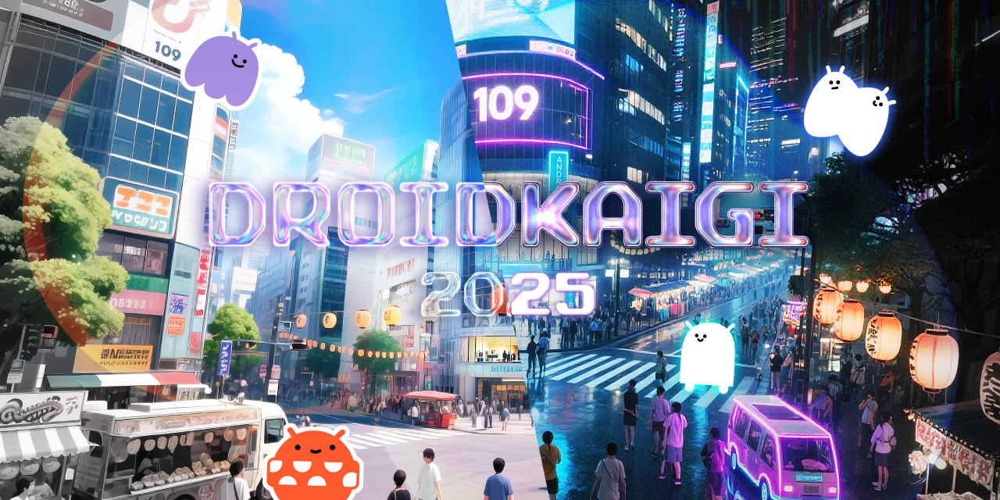
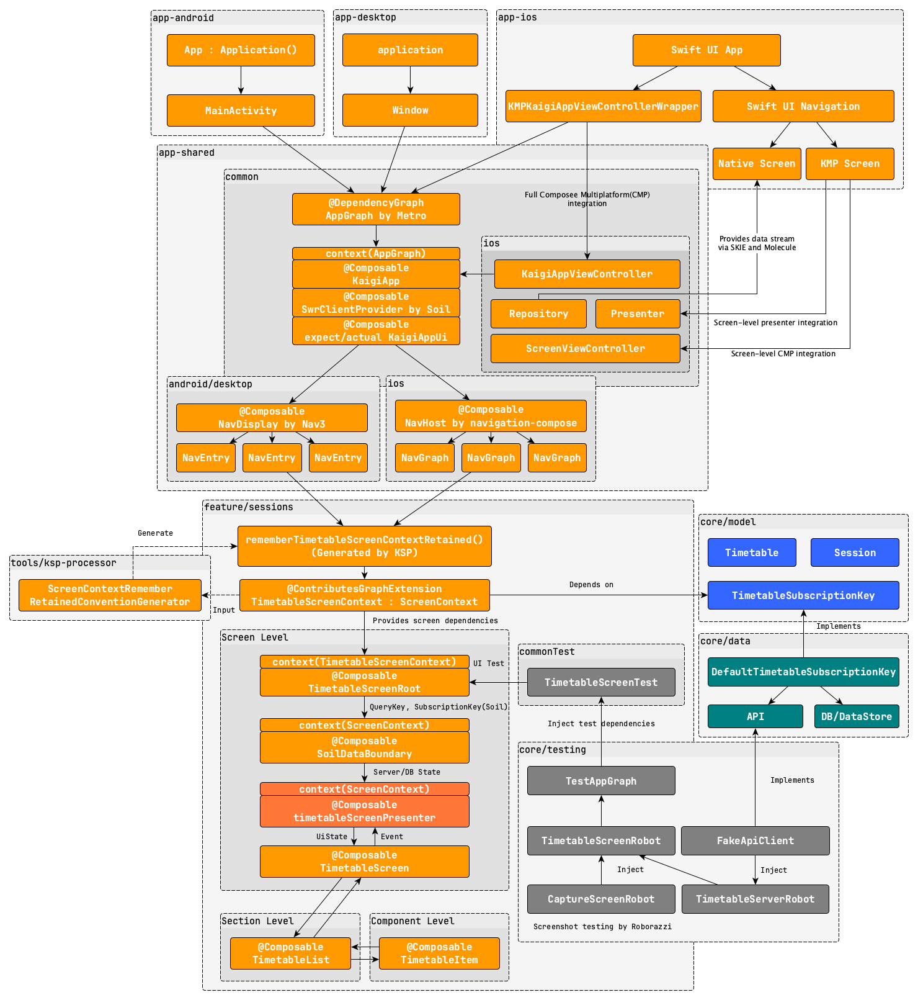

# DroidKaigi 2025 official app

[DroidKaigi](https://2025.droidkaigi.jp) marks its 11th edition this year!
This conference is designed for Android developers to enhance knowledge sharing and communication.
It will take place over 3 days, from 10 to 12 September 2025.

## Features

The DroidKaigi 2025 official app offers a variety of features to enhance your conference experience:

- **Timetable**: View the schedule and bookmark your favorite sessions.
- **Profile cards**: Create and share your profile with other attendees.
- **Contributors**: Discover the contributors behind the app. ...and more!

## Contributing

We welcome contributions!

For a step-by-step guide on how to contribute, see
[CONTRIBUTING.md](CONTRIBUTING.md). It walks you through everything from
setting up your environment to submitting a pull request.

For Japanese speakers, a Japanese version is available:
[CONTRIBUTING.ja.md](CONTRIBUTING.ja.md).

コントリビューションの詳細な手順については [CONTRIBUTING.ja.md](CONTRIBUTING.ja.md) をご覧ください。
初めての方でもわかりやすいステップバイステップのガイドを用意しています。

## Requirements

Stable Android Studio Narwhal or higher. You can download it from
[this page](https://developer.android.com/studio).

## Design

You can check out the UI design on Figma:
[DroidKaigi 2025 App UI](https://www.figma.com/design/1YjyMBNVLEGcHP4W7UNzDE/DroidKaigi-2025-App-UI)

## Development

### Overview of the architecture

Based on last year's architecture, we've redesigned our approach to improve the app development
experience further by introducing the following concepts:

- A more composable-first approach, replacing repository classes
  with [Soil](https://github.com/soil-kt/soil)
- Compile-time-safe dependency injection with [Metro](https://github.com/ZacSweers/metro)
- Structuring the codebase with context parameters to provide clearer semantic meaning to Composable
  functions.

Here's a big picture of this year's architecture:



The following sections describe how this architecture works in practice.

### Dependency Injection via ScreenContext

Unlike last year, we no longer rely on `CompositionLocal` to provide dependencies.  
Instead, we use [Metro](https://github.com/ZacSweers/metro) to resolve each screen's dependencies
at compile time and provide them via a single `ScreenContext`.

This approach clarifies which dependencies are required for a screen and helps prevent potential
runtime errors caused by missing dependencies.

```kotlin
context(screenContext: TimetableScreenContext)
@Composable
fun TimetableScreenRoot(...) {
    // ...
}

@ContributesGraphExtension(TimetableScope::class)
interface TimetableScreenContext : ScreenContext {
    val timetableSubscriptionKey: TimetableSubscriptionKey

    @ContributesGraphExtension.Factory(AppScope::class)
    fun interface Factory {
        fun createTimetableScreenContext(): TimetableScreenContext
    }
}
```

More importantly, we provide the ScreenContext as a context parameter to give Composable functions
additional semantic context. This allows us to restrict the usage of certain functions to their
specific screen scope—for example, the SoilDataBoundary described in the following section.

### Data Boundary with Soil

At the root of the screen, we can use `SoilDataBoundary` to separate data fetching logic from
UI logic. Within its trailing content lambda, we can safely assume that all data is
available and ready to be used in the UI.

```kotlin
context(screenContext: TimetableScreenContext)
@Composable
fun TimetableScreenRoot(...) {
    SoilDataBoundary(
        state1 = rememberQuery(screenContext.timetableQueryKey),
        state2 = rememberSubscription(screenContext.favoriteTimetableIdsSubscriptionKey),
        fallback = ...,
    ) { timetable, favoriteTimetableItemIds ->
        // All data required to render the screen is guaranteed to be available here.
    }
}

context(_: ScreenContext) // This function can be called within any ScreenContext
@Composable
fun <T1, T2> SoilDataBoundary(
    state1: State<T1>,
    state2: State<T2>,
    ...,
    content: @Composable (T1, T2) -> Unit,
) {
    ErrorBoundary(...) {
        Suspense(...) {
            Await(state1, state2, content)
        }
    }
}
```

The `QueryKey` and `SubscriptionKey` provided by Soil are responsible for fetching
the server or database state, and runtime caching is handled by Soil’s `SwrClient`.
Therefore, we no longer need repository implementations to manually manage data fetching and caching.

```kotlin
typealias TimetableQueryKey = QueryKey<Timetable>

@ContributesBinding(DataScope::class)
@Inject
public class DefaultTimetableQueryKey(
    private val sessionsApiClient: SessionsApiClient,
    private val dataStore: SessionCacheDataStore,
) : TimetableQueryKey by buildQueryKey(
    id = QueryId("timetable"),
    fetch = {
        val response = sessionsApiClient.sessionsAllResponse()
        dataStore.save(response)
        response.toTimetable()
    },
) {
    override fun onPreloadData(): QueryPreloadData<Timetable>? {
        return { dataStore.getCache()?.toTimetable() }
    }
}
```

### Composing the Presenters

The next step is to present the data in the UI. Presenters are responsible for handling UI
events and constructing the UI state. As with last year, we designed them as composable functions.

```kotlin
context(screenContext: TimetableScreenContext)
@Composable
fun TimetableScreenRoot(...) {
    SoilDataBoundary(...) { timetable, favoriteTimetableItemIds ->
        val eventFlow = rememberEventFlow<TimetableScreenEvent>()

        val uiState = timetableScreenPresenter(
            eventFlow = eventFlow,
            timetable = timetable.copy(bookmarks = favoriteTimetableItemIds),
        )

        TimetableScreen(uiState = uiState, ...)
    }
}

// The dependencies for presenter are also provided via screenContext.
context(screenContext: TimetableScreenContext)
@Composable
fun timetableScreenPresenter(
    eventFlow: EventFlow<TimetableScreenEvent>,
    timetable: Timetable,
): TimetableScreenUiState = providePresenterDefaults {
    // Build and return the UI state based on the given data and user events
}
```

Presenters receive `eventFlow`, then handle the UI events inside `EventEffect` and mutate the UI
state or database state.

```kotlin
context(screenContext: TimetableScreenContext)
@Composable
fun timetableScreenPresenter(
    eventFlow: EventFlow<TimetableScreenEvent>,
    timetable: Timetable,
): TimetableScreenUiState = providePresenterDefaults {
    val bookmarkMutation = rememberMutation(screenContext.favoriteTimetableItemIdMutationKey)

    EventEffect(eventFlow) { event ->
        when (event) {
            is TimetableScreenEvent.Bookmark -> {
                bookmarkMutation.mutate(event.timetableItemId)
            }
            // Handle other events...
        }
    }

    return TimetableScreenUiState(...)
}
```

### Understanding App Entry Point

The `KaigiApp` composable serves as the app’s entry point, setting up navigation and providing necessary dependencies.

```kotlin
@Composable
context(appGraph: AppGraph)
fun KaigiApp() {
    SwrClientProvider(SwrCachePlus(SwrCacheScope())) {
        KaigiTheme {
            Surface {
                KaigiAppUi()
            }
        }
    }
}
```

`appGraph` is a platform-specific dependency graph. 
It is supplied via a context parameter from each platform’s entry point.

```kotlin
// android
class App : Application() {
    val appGraph: AppGraph by lazy {
        createGraphFactory<AndroidAppGraph.Factory>()
            .createAndroidAppGraph(applicationContext = this, ...)
    }
}

val Context.appGraph: AppGraph get() = (applicationContext as App).appGraph

class MainActivity : ComponentActivity() {
    override fun onCreate(savedInstanceState: Bundle?) {
        ...
        // We pass appGraph to KaigiApp using the context receiver, 
        // so all Composables inside can access dependencies.
        with(appGraph) {
            setContent {
                KaigiApp()
            }
        }
    }
}

// jvm
fun main() = application {
    val graphFactory = createGraphFactory<JvmAppGraph.Factory>()
    val graph: JvmAppGraph = graphFactory.createJvmAppGraph(...)

    Window(...) {
        // On JVM, we create the `JvmAppGraph` and provide it to `KaigiApp` via a context receiver,
        // similar to Android.
        with(graph) {
            KaigiApp()
        }
    }
}

// ios
fun kaigiAppViewController(appGraph: AppGraph): UIViewController = ComposeUIViewController {
    // On iOS, the appGraph instance is managed by the Swift side.
    // Since iOS cannot use context receivers directly, we wrap KaigiApp in a function that accepts appGraph as a parameter.
    with(appGraph) {
        KaigiApp()
    }
}
```

### Navigating between Screens

For navigation, we use the official Navigation3 library on Android and JVM.
Since iOS does not yet support Navigation3, we use navigation-compose on iOS instead.

To share the `KaigiApp` across platforms, we define `KaigiAppUi` as an expect function, with platform-specific `actual` implementations:

```kotlin
@Composable
context(appGraph: AppGraph)
expect fun KaigiAppUi()

// android and jvm
@Composable
context(appGraph: AppGraph)
actual fun KaigiAppUi() {
    // Navigation3 implementation
}

// ios
@Composable
context(appGraph: AppGraph)
actual fun KaigiAppUi() {
    // navigation-compose implementation
}
```

Here, we will focus on the Navigation3 implementation, as it represents the primary change for this year.
In navigation3, each screen is represented by a `NavEntry` with a corresponding `NavKey`.

For example, the `TimetableScreen` is represented by `TimetableNavKey`:

```kotlin
@Serializable
data object TimetableNavKey : NavKey

context(appGraph: AppGraph)
fun EntryProviderBuilder<NavKey>.timetableEntry(
    onSearchClick: () -> Unit,
    onTimetableItemClick: (TimetableItemId) -> Unit,
) {
    entry<TimetableNavKey>(...) {
        with(appGraph.rememberTimetableScreenContextRetained()) {
            TimetableScreenRoot(
                onSearchClick = onSearchClick,
                onTimetableItemClick = onTimetableItemClick,
            )
        }
    }
}
```

Then we register this entry in the NavDisplay’s entryProvider:

```kotlin
@Composable
context(appGraph: AppGraph)
fun KaigiAppUi() {
    val backStack = rememberNavBackStack(TimetableNavKey)
    // Simplified version for demonstration; actual code includes other entries and parameters, etc.
    NavDisplay(
        backStack = backStack,
        entryProvider = entryProvider {
            timetableEntry(
                // Navigates to Search or TimetableDetail screens by updating the back stack
                onSearchClick = { backStack.add(SearchNavKey) },
                onTimetableItemClick = { backStack.add(TimetableItemDetailNavKey(it)) },
            )
            // Define other entries...
        },
        ...,
    )
}
```

Note: We use `rememberTimetableScreenContextRetained()` to create a retained instance of the `TimetableScreenContext`.
This helper function is generated by KSP and allows the `ScreenContext` to persist across recompositions, keeping the code clean and readable:

```kotlin
@Composable
context(factory: TimetableScreenContext.Factory)
fun rememberTimetableScreenContextRetained(): TimetableScreenContext {
    return rememberRetained { factory.createTimetableScreenContext() }
}
```

### Multiplatform UI Testing

Last year, we introduced a Behavior-Driven Development (BDD) style for our UI tests,
where scenarios are expressed with `describe` blocks and expected outcomes with `itShould`.
This approach made our tests more expressive and easier to extend.

This year, we extend this approach by sharing UI tests across Android, JVM, and iOS 
using Kotlin Multiplatform’s expect/actual mechanism, allowing the same tests to run on all platforms.

```kotlin
expect abstract class Runner

expect class UiTestRunner : Runner

expect annotation class RunWith(val value: KClass<out Runner>)

expect annotation class ComposeTest()

// This test runs on Android, JVM, and iOS platforms!
@RunWith(UiTestRunner::class)
class TimetableScreenTest {
    @ComposeTest
    fun runTest() {
        // Test implementation goes here
    }
}
```

Test cases follow the BDD style: scenarios with `describe`, setup with `doIt`, and expectations with `itShould`.

```kotlin
// This test runs on Android, JVM, and iOS platforms!
@RunWith(UiTestRunner::class)
class TimetableScreenTest {
    // A test-specific dependency graph
    val testAppGraph = createTimetableScreenTestGraph()
    
    @ComposeTest
    fun runTest() {
        describedBehaviors.forEach { behavior ->
            val robot = testAppGraph.timetableScreenRobotProvider()
            runComposeUiTest {
                behavior.execute(robot)
            }
        }
    }

    val describedBehaviors = describeBehaviors<TimetableScreenRobot>("TimetableScreen") {
        describe("when server is operational") {
            doIt {
                setupTimetableServer(ServerStatus.Operational)
                setupTimetableScreenContent()
            }
            itShould("show loading indicator") {
                captureScreenWithChecks {
                    checkLoadingIndicatorDisplayed()
                }
            }
            // ...
        }
        describe("when server is error") {
            // ...
        }
    }
}
```

Robots handle UI interactions and verifications, and can be extended easily for new scenarios.

```kotlin
@Inject
class TimetableScreenRobot(
    private val screenContext: TimetableScreenContext,
    private val testDispatcher: TestDispatcher,
    timetableServerRobot: DefaultTimetableServerRobot,
    captureScreenRobot: DefaultCaptureScreenRobot,
    waitRobot: DefaultWaitRobot,
) : TimetableServerRobot by timetableServerRobot,
    CaptureScreenRobot by captureScreenRobot,
    WaitRobot by waitRobot {

    context(composeUiTest: ComposeUiTest)
    fun setupTimetableScreenContent() {
        composeUiTest.setContent {
            with(screenContext) {
                TestDefaultsProvider(testDispatcher) {
                    TimetableScreenRoot(
                        onSearchClick = {},
                        onTimetableItemClick = {},
                    )
                }
            }
        }
    }

    context(composeUiTest: ComposeUiTest)
    fun checkLoadingIndicatorDisplayed() {
        composeUiTest.onNodeWithTag(DefaultSuspenseFallbackContentTestTag).assertExists()
    }
    
    ...
}
```

Metro allows us to replace dependencies with test-specific implementations,
creating a test dependency graph that ensures isolation from production 
and consistent cross-platform execution.

```kotlin
// android
@DependencyGraph(
    scope = AppScope::class,
    additionalScopes = [DataScope::class],
    isExtendable = true,
    // Exclude production implementations for testing
    excludes = [
        DefaultSessionsApiClient::class,
        CoroutineDispatcher::class,
        ...,
    ],
)
internal interface AndroidTestAppGraph : TestAppGraph { ... }

// common
internal interface TestAppGraph : TimetableScreenTestGraph, ... {
    @Binds
    val FakeSessionsApiClient.binds: SessionsApiClient
    
    ...
}

expect fun createTestAppGraph(): TestAppGraph

fun createTimetableScreenTestGraph(): TimetableScreenTestGraph = createTestAppGraph()
```

### Kotlin Multiplatform Integration on iOS

This year, we integrated Kotlin Multiplatform (KMP) into the iOS app in the following ways:

1. **Repository access on each screen**  
   Repository classes are exposed to iOS. [Molecule](https://github.com/cashapp/molecule) converts the Compose state provided by Soil into Flows, enabling SwiftUI views to reactively observe changes.

2. **Full Compose Multiplatform (CMP) integration**  
   The entire `KaigiApp` runs on iOS using a `ComposeUIViewController`, enabling reuse of Composable UI code across platforms.

3. **Screen-level KMP Presenter integration (FavoriteScreen)**  
   The KMP presenter's UI state is mapped into SwiftUI views on the FavoriteScreen, allowing the UI to remain native SwiftUI while reusing shared business logic.

4. **Screen-level CMP integration (FavoriteScreen)**  
   FavoriteScreen uses Compose Multiplatform UI, allowing partial adoption of CMP on iOS and enabling incremental migration.
